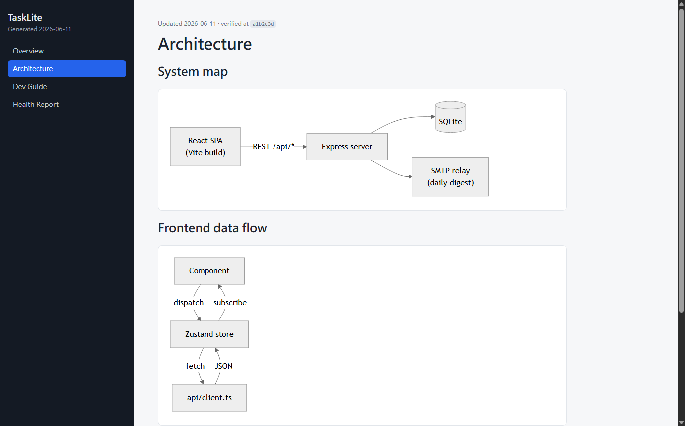
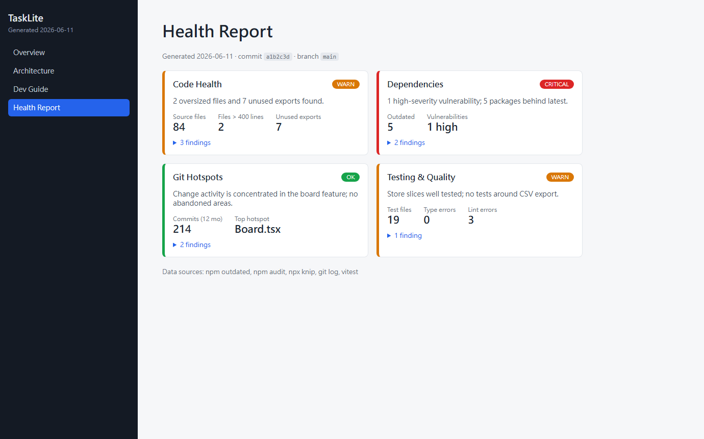

# project-handbook

[繁體中文](./README.zh-TW.md)

A [Claude Code](https://claude.com/claude-code) skill that turns any JS/TS project into a
**dual-audience handbook**: a browsable HTML site for humans, backed by markdown/JSON
data files that AI agents read directly. One set of files, two audiences, never out of
sync.

**▶ [Live Demo](https://gexianss.github.io/project-handbook/)** — browse a generated
handbook right in your browser, no install needed.




## What it does

1. **Scans** the project — code health (oversized files, dead exports), dependency
   freshness & vulnerabilities, git hotspots, testing gaps. Real tools first
   (`npm audit`, `knip`, `git log`); honest `unknown` when a tool can't run.
2. **Interviews you** for everything the code can't say — where it's deployed, who owns
   the backend, how the team works, machine capacity. Questions are generated from the
   scan, asked in one batch. Unknown answers become a **⚠️ To-confirm list** with
   pointers on where to find out, not guesses.
3. **Generates `docs-site/`** in your project:
   - `index.html` + viewer — sidebar navigation, Mermaid architecture diagrams, health
     dashboard. Fully offline (libraries vendored).
   - `data/*.md` + `health.json` — the actual content. AI agents read these directly;
     the viewer renders the same files for humans.
   - `open-handbook.bat` / `.sh` — double-click to serve and open (needs Node ≥ 18).

The viewer template never changes after generation. AI maintains only `data/` — so
updating the handbook is editing a few markdown files, and the site is instantly current.

Every page carries a freshness mark — "Updated <date> · verified at <commit>" — and
re-running on an updated project does a **diff-driven audit**: only sections whose
related files actually changed get re-read and rewritten; the rest are proven current
by the git diff itself.

## Viewing the handbook

The viewer loads `data/*.md` with `fetch()` at runtime, and browsers block fetch on
`file://` pages — so the handbook must be opened over HTTP. Any of these works:

- **Double-click** `docs-site/open-handbook.bat` (Windows) or run
  `docs-site/open-handbook.sh` (macOS/Linux) — starts the bundled server and opens
  your browser. Needs nothing but Node.
- **Live Server** — in VS Code / Cursor, right-click `docs-site/index.html` →
  *Open with Live Server*. Bonus: the page auto-reloads whenever a `data/*.md` file
  is saved.
- **Any static server** — e.g. `node docs-site/serve.cjs 8787`, then open
  `http://localhost:8787`.

### What's inside docs-site/

| File | Why it exists |
|---|---|
| `data/` | The handbook content (md/json) — the only thing AI ever edits |
| `index.html` + `assets/viewer.*` | The viewer: sidebar, Mermaid rendering, health dashboard |
| `assets/vendor/` | marked + mermaid bundled locally (~2.6 MB) so the handbook works fully offline — no CDN, no npm install |
| `serve.cjs` | Zero-dependency static server, because browsers block fetch on `file://` |
| `open-handbook.bat` / `.sh` | Double-click launchers for Windows / macOS / Linux — for readers without a dev setup |

## Install

```
/plugin marketplace add Gexianss/project-handbook
/plugin install project-handbook@project-handbook-marketplace
```

Or manually: copy `skills/project-handbook/` into `~/.claude/skills/`.

## Use

In any JS/TS project, ask Claude Code:

> Generate a project handbook

or in Chinese: 幫專案做手冊 / 專案體檢. Re-running on a project that already has a
handbook offers an **audit & refresh** instead of overwriting.

## Scope & requirements

- Designed for JS/TS projects (npm / pnpm / yarn). Other ecosystems: scan degrades
  gracefully to AI-only analysis.
- Node ≥ 18 to serve the handbook locally.
- Handbook content language follows your language (English, 繁體中文, …); viewer UI is
  English.

## Demo

`examples/demo/` is a generated handbook for a fictional app — open it with
`examples/demo/open-handbook.bat` (or `.sh`).

## License

[MIT](./LICENSE). Vendored libraries: [marked](https://github.com/markedjs/marked) (MIT),
[mermaid](https://github.com/mermaid-js/mermaid) (MIT).
