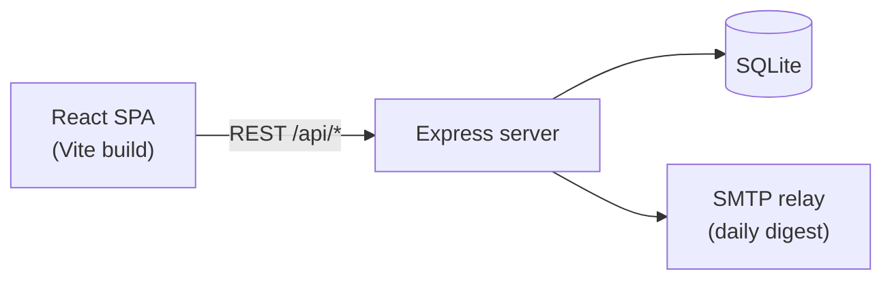
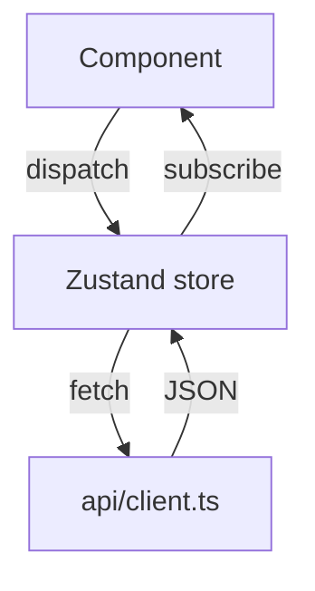

# project-handbook Implementation Plan

> **For agentic workers:** REQUIRED SUB-SKILL: Use superpowers:subagent-driven-development (recommended) or superpowers:executing-plans to implement this plan task-by-task. Steps use checkbox (`- [ ]`) syntax for tracking.

**Goal:** Build and publish `project-handbook` — a Claude Code plugin (GitHub-public) whose skill scans a JS/TS project, interviews the user for off-code knowledge, and generates a dual-audience handbook: a browsable HTML site for humans backed by md/json data files that AI reads directly.

**Architecture:** Plugin repo at `C:\Users\user\Desktop\project\project-handbook`. The skill ships a static viewer template (`index.html` + vanilla JS/CSS + vendored marked.js/mermaid.js + zero-dependency node static server). At runtime the skill copies the template into the target project's `docs-site/` and writes only `data/` files (md/json). Template never changes after generation; AI maintains only `data/`.

**Tech Stack:** Vanilla HTML/CSS/JS (no build step), marked.js v12 + mermaid v11 (vendored), Node ≥18 (serve script + tests via `node:test`), Claude Code plugin format (`.claude-plugin/`).

**Working directory:** All commands run from repo root `C:\Users\user\Desktop\project\project-handbook` unless stated otherwise. Shell is Windows PowerShell 5.1 — no `&&`; chain with `;` or separate calls. Git/node/curl commands work as-is.

**Spec:** `docs/specs/2026-06-11-project-handbook-design.md` (copied into repo in Task 1).

**Plan-file note:** During execution, keep updating checkboxes in the ORIGINAL plan at `C:\Users\user\.claude\skills\project-handbook\docs\plans\2026-06-11-project-handbook-implementation.md`. The final cleanup task (Task 12) syncs the finished plan into the repo and deletes the old scaffold folder. Do not delete `C:\Users\user\.claude\skills\project-handbook\` before Task 12.

---

## File Structure (final repo layout)

```
project-handbook/
├─ .claude-plugin/
│  ├─ plugin.json                  ← plugin metadata
│  └─ marketplace.json             ← lets users /plugin marketplace add
├─ skills/
│  └─ project-handbook/
│     ├─ SKILL.md                  ← English, 5-phase workflow
│     ├─ references/
│     │  └─ health-schema.md      ← health.json schema reference
│     └─ template/                 ← copied verbatim into target projects
│        ├─ index.html
│        ├─ serve.cjs              ← zero-dep static server
│        ├─ open-handbook.bat
│        ├─ open-handbook.sh
│        └─ assets/
│           ├─ viewer.css
│           ├─ viewer.js
│           └─ vendor/
│              ├─ marked.min.js
│              ├─ mermaid.min.js
│              └─ LICENSES.md
├─ examples/
│  └─ demo/                        ← assembled showcase (template + sample data)
│     └─ data/                     ← fictional "TaskLite" sample handbook
├─ scripts/
│  └─ build-demo.mjs               ← copies template → examples/demo
├─ tests/
│  └─ serve.test.mjs               ← node:test for serve.cjs
├─ docs/
│  ├─ specs/  ├─ plans/            ← design + this plan
│  └─ assets/                      ← README screenshots
├─ README.md / README.zh-TW.md / LICENSE / .gitignore
```

---

### Task 1: Repo skeleton + plugin manifests

**Files:**
- Create: `.gitignore`, `LICENSE`, `.claude-plugin/plugin.json`, `.claude-plugin/marketplace.json`
- Copy in: `docs/specs/2026-06-11-project-handbook-design.md`, `docs/plans/2026-06-11-project-handbook-implementation.md`

- [ ] **Step 1: Create repo directory and git init**

```powershell
New-Item -ItemType Directory -Force "C:\Users\user\Desktop\project\project-handbook"
git -C "C:\Users\user\Desktop\project\project-handbook" init
```
Expected: `Initialized empty Git repository`.

- [ ] **Step 2: Write `.gitignore`**

```gitignore
node_modules/
.tmp/
*.log
```

- [ ] **Step 3: Write `LICENSE` (MIT)**

```text
MIT License

Copyright (c) 2026 shiaushen

Permission is hereby granted, free of charge, to any person obtaining a copy
of this software and associated documentation files (the "Software"), to deal
in the Software without restriction, including without limitation the rights
to use, copy, modify, merge, publish, distribute, sublicense, and/or sell
copies of the Software, and to permit persons to whom the Software is
furnished to do so, subject to the following conditions:

The above copyright notice and this permission notice shall be included in all
copies or substantial portions of the Software.

THE SOFTWARE IS PROVIDED "AS IS", WITHOUT WARRANTY OF ANY KIND, EXPRESS OR
IMPLIED, INCLUDING BUT NOT LIMITED TO THE WARRANTIES OF MERCHANTABILITY,
FITNESS FOR A PARTICULAR PURPOSE AND NONINFRINGEMENT. IN NO EVENT SHALL THE
AUTHORS OR COPYRIGHT HOLDERS BE LIABLE FOR ANY CLAIM, DAMAGES OR OTHER
LIABILITY, WHETHER IN AN ACTION OF CONTRACT, TORT OR OTHERWISE, ARISING FROM,
OUT OF OR IN CONNECTION WITH THE SOFTWARE OR THE USE OR OTHER DEALINGS IN THE
SOFTWARE.
```

- [ ] **Step 4: Write `.claude-plugin/plugin.json`**

```json
{
  "name": "project-handbook",
  "version": "0.1.0",
  "description": "Scan a JS/TS project, interview the user for knowledge that lives outside the code, and generate a dual-audience handbook: a browsable HTML site for humans backed by md/json data files for AI.",
  "author": {
    "name": "shiaushen",
    "email": "shiaushen@gmail.com"
  }
}
```

- [ ] **Step 5: Write `.claude-plugin/marketplace.json`**

```json
{
  "name": "project-handbook-marketplace",
  "owner": {
    "name": "shiaushen",
    "email": "shiaushen@gmail.com"
  },
  "plugins": [
    {
      "name": "project-handbook",
      "source": "./",
      "description": "Generate a dual-audience project handbook for JS/TS projects: health scan + user interview + HTML site for humans + md/json data for AI."
    }
  ]
}
```

- [ ] **Step 6: Copy spec and plan into repo (COPY, not move — see plan-file note)**

```powershell
New-Item -ItemType Directory -Force docs\specs, docs\plans, docs\assets
Copy-Item "C:\Users\user\.claude\skills\project-handbook\docs\specs\2026-06-11-project-handbook-design.md" docs\specs\
Copy-Item "C:\Users\user\.claude\skills\project-handbook\docs\plans\2026-06-11-project-handbook-implementation.md" docs\plans\
```

- [ ] **Step 7: Commit**

```powershell
git add -A
git commit -m "chore: repo skeleton, plugin manifests, MIT license, design docs"
```

---

### Task 2: Zero-dependency static server + launch scripts + tests

**Files:**
- Create: `skills/project-handbook/template/serve.cjs`
- Create: `skills/project-handbook/template/open-handbook.bat`
- Create: `skills/project-handbook/template/open-handbook.sh`
- Test: `tests/serve.test.mjs`

- [ ] **Step 1: Write the failing test `tests/serve.test.mjs`**

```js
import { test } from "node:test";
import assert from "node:assert/strict";
import { spawn } from "node:child_process";
import path from "node:path";
import { fileURLToPath } from "node:url";

const repo = path.join(path.dirname(fileURLToPath(import.meta.url)), "..");
const serve = path.join(repo, "skills", "project-handbook", "template", "serve.cjs");

function startServer(port) {
  return new Promise((resolve, reject) => {
    const child = spawn(process.execPath, [serve, String(port)], {
      stdio: ["ignore", "pipe", "pipe"],
    });
    const timer = setTimeout(() => reject(new Error("server did not start")), 5000);
    child.stdout.once("data", () => { clearTimeout(timer); resolve(child); });
    child.on("error", (err) => { clearTimeout(timer); reject(err); });
  });
}

test("serves an existing file with correct content type", async () => {
  const child = await startServer(8899);
  try {
    const res = await fetch("http://localhost:8899/serve.cjs");
    assert.equal(res.status, 200);
    assert.match(res.headers.get("content-type"), /text\/javascript/);
  } finally {
    child.kill();
  }
});

test("returns 404 for missing files", async () => {
  const child = await startServer(8898);
  try {
    const res = await fetch("http://localhost:8898/nope.html");
    assert.equal(res.status, 404);
  } finally {
    child.kill();
  }
});

test("blocks path traversal outside template root", async () => {
  const child = await startServer(8897);
  try {
    const res = await fetch("http://localhost:8897/..%2f..%2f..%2f..%2fREADME.md");
    assert.ok(res.status === 403 || res.status === 404, `got ${res.status}`);
  } finally {
    child.kill();
  }
});
```

- [ ] **Step 2: Run test to verify it fails**

```powershell
node --test tests/
```
Expected: FAIL — `Cannot find module ... serve.cjs` (server doesn't exist yet).

- [ ] **Step 3: Write `skills/project-handbook/template/serve.cjs`**

```js
#!/usr/bin/env node
/* Tiny static server for the Project Handbook. Zero dependencies.
   Usage: node serve.cjs [port]   (default 8787) */
const http = require("http");
const fs = require("fs");
const path = require("path");

const root = __dirname;
const rootPrefix = root.endsWith(path.sep) ? root : root + path.sep;
const port = Number(process.argv[2]) || 8787;

const types = {
  ".html": "text/html; charset=utf-8",
  ".js": "text/javascript; charset=utf-8",
  ".cjs": "text/javascript; charset=utf-8",
  ".mjs": "text/javascript; charset=utf-8",
  ".css": "text/css; charset=utf-8",
  ".json": "application/json; charset=utf-8",
  ".md": "text/markdown; charset=utf-8",
  ".svg": "image/svg+xml",
  ".png": "image/png",
  ".jpg": "image/jpeg",
  ".gif": "image/gif",
  ".ico": "image/x-icon",
};

http
  .createServer((req, res) => {
    const urlPath = decodeURIComponent(req.url.split("?")[0]);
    const filePath = path.normalize(
      path.join(root, urlPath === "/" ? "index.html" : urlPath)
    );
    if (filePath !== path.join(root, "index.html") && !filePath.startsWith(rootPrefix)) {
      res.writeHead(403, { "Content-Type": "text/plain" });
      res.end("403 Forbidden");
      return;
    }
    fs.readFile(filePath, (err, buf) => {
      if (err) {
        res.writeHead(404, { "Content-Type": "text/plain" });
        res.end("404 Not Found: " + urlPath);
        return;
      }
      res.writeHead(200, {
        "Content-Type":
          types[path.extname(filePath).toLowerCase()] || "application/octet-stream",
        "Cache-Control": "no-store",
      });
      res.end(buf);
    });
  })
  .listen(port, () => {
    console.log("Project Handbook -> http://localhost:" + port);
  });
```

- [ ] **Step 4: Run tests to verify they pass**

```powershell
node --test tests/
```
Expected: `pass 3` / `fail 0`.

- [ ] **Step 5: Write `skills/project-handbook/template/open-handbook.bat`**

```bat
@echo off
cd /d "%~dp0"
start "" http://localhost:8787
node serve.cjs 8787
```

- [ ] **Step 6: Write `skills/project-handbook/template/open-handbook.sh`**

```sh
#!/usr/bin/env sh
cd "$(dirname "$0")" || exit 1
( sleep 1; open "http://localhost:8787" 2>/dev/null || xdg-open "http://localhost:8787" 2>/dev/null ) &
node serve.cjs 8787
```

- [ ] **Step 7: Commit**

```powershell
git add -A
git commit -m "feat: zero-dependency static server with launch scripts and tests"
```

---

### Task 3: Vendor marked.js + mermaid.js

**Files:**
- Create: `skills/project-handbook/template/assets/vendor/marked.min.js`
- Create: `skills/project-handbook/template/assets/vendor/mermaid.min.js`
- Create: `skills/project-handbook/template/assets/vendor/LICENSES.md`

- [ ] **Step 1: Download pinned versions**

```powershell
New-Item -ItemType Directory -Force skills\project-handbook\template\assets\vendor
curl.exe -L -o skills\project-handbook\template\assets\vendor\marked.min.js https://unpkg.com/marked@12.0.2/marked.min.js
curl.exe -L -o skills\project-handbook\template\assets\vendor\mermaid.min.js https://unpkg.com/mermaid@11.4.1/dist/mermaid.min.js
```

- [ ] **Step 2: Verify downloads are real JS, not error pages**

```powershell
(Get-Item skills\project-handbook\template\assets\vendor\marked.min.js).Length
(Get-Item skills\project-handbook\template\assets\vendor\mermaid.min.js).Length
Get-Content skills\project-handbook\template\assets\vendor\marked.min.js -TotalCount 1
```
Expected: marked > 30 KB, mermaid > 1 MB; first line starts with `/**` or minified JS — NOT `<html`. If either file looks like HTML, the unpkg path is wrong: try `https://cdn.jsdelivr.net/npm/marked@12.0.2/marked.min.js` and `https://cdn.jsdelivr.net/npm/mermaid@11.4.1/dist/mermaid.min.js`.

- [ ] **Step 3: Write `skills/project-handbook/template/assets/vendor/LICENSES.md`**

```markdown
# Vendored libraries

| Library | Version | License | Source |
|---|---|---|---|
| marked | 12.0.2 | MIT | https://github.com/markedjs/marked |
| mermaid | 11.4.1 | MIT | https://github.com/mermaid-js/mermaid |

Both libraries are vendored unmodified so the handbook works fully offline.
```

- [ ] **Step 4: Commit**

```powershell
git add -A
git commit -m "feat: vendor marked@12.0.2 and mermaid@11.4.1 for offline viewing"
```

---

### Task 4: Viewer shell — index.html + viewer.css

**Files:**
- Create: `skills/project-handbook/template/index.html`
- Create: `skills/project-handbook/template/assets/viewer.css`

- [ ] **Step 1: Write `skills/project-handbook/template/index.html`**

```html
<!doctype html>
<html lang="en">
<head>
  <meta charset="utf-8">
  <meta name="viewport" content="width=device-width, initial-scale=1">
  <title>Project Handbook</title>
  <link rel="stylesheet" href="assets/viewer.css">
</head>
<body>
  <aside class="sidebar">
    <h1 id="project-name">Project Handbook</h1>
    <p id="generated-at" class="muted"></p>
    <nav id="sidebar-nav"></nav>
  </aside>
  <main id="content"><p class="loading">Loading&hellip;</p></main>
  <script src="assets/vendor/marked.min.js"></script>
  <script src="assets/vendor/mermaid.min.js"></script>
  <script src="data/manifest.js"></script>
  <script src="assets/viewer.js"></script>
</body>
</html>
```

- [ ] **Step 2: Write `skills/project-handbook/template/assets/viewer.css`**

```css
* { box-sizing: border-box; }
body {
  margin: 0;
  display: grid;
  grid-template-columns: 270px 1fr;
  min-height: 100vh;
  font-family: system-ui, "Segoe UI", "Noto Sans TC", sans-serif;
  color: #1c2430;
  background: #f6f7f9;
}
.sidebar {
  background: #141a24;
  color: #e8ecf2;
  padding: 24px 16px;
  position: sticky;
  top: 0;
  height: 100vh;
  overflow-y: auto;
}
.sidebar h1 { font-size: 18px; margin: 0 0 4px; }
.sidebar .muted { color: #8b97a8; font-size: 12px; margin: 0 0 20px; }
#sidebar-nav { display: flex; flex-direction: column; gap: 2px; }
#sidebar-nav a {
  color: #c4cdd9;
  text-decoration: none;
  padding: 8px 10px;
  border-radius: 6px;
  font-size: 14px;
}
#sidebar-nav a:hover { background: #1f2937; color: #fff; }
#sidebar-nav a.active { background: #2563eb; color: #fff; }
main { padding: 40px 48px; max-width: 920px; min-width: 0; }
main h1 { margin-top: 0; }
main img { max-width: 100%; }
main pre {
  background: #141a24;
  color: #e8ecf2;
  padding: 14px 16px;
  border-radius: 8px;
  overflow-x: auto;
  font-size: 13px;
}
main code { font-family: ui-monospace, Consolas, monospace; font-size: 0.92em; }
main :not(pre) > code { background: #e6e9ee; padding: 1px 5px; border-radius: 4px; }
main table { border-collapse: collapse; }
main th, main td { border: 1px solid #d4d9e0; padding: 6px 10px; font-size: 14px; }
main th { background: #eef1f5; }
main blockquote {
  border-left: 4px solid #2563eb;
  margin: 0;
  padding: 4px 16px;
  color: #475264;
  background: #eef2f8;
}
.mermaid-diagram {
  background: #fff;
  border: 1px solid #e2e6eb;
  border-radius: 8px;
  padding: 16px;
  margin: 16px 0;
  overflow-x: auto;
}
.error { color: #b91c1c; }
.loading { color: #6b7280; }
.page-meta { color: #6b7280; font-size: 12px; margin: 0 0 12px; }

/* Health dashboard */
.health-meta { color: #6b7280; font-size: 13px; }
.facet-grid {
  display: grid;
  grid-template-columns: repeat(auto-fit, minmax(320px, 1fr));
  gap: 16px;
  margin: 20px 0;
}
.facet {
  background: #fff;
  border: 1px solid #e2e6eb;
  border-left-width: 5px;
  border-radius: 8px;
  padding: 16px;
}
.facet-ok { border-left-color: #16a34a; }
.facet-warn { border-left-color: #d97706; }
.facet-critical { border-left-color: #dc2626; }
.facet-unknown { border-left-color: #9ca3af; }
.facet header { display: flex; justify-content: space-between; align-items: center; gap: 8px; }
.facet h2 { font-size: 16px; margin: 0; }
.pill {
  font-size: 11px;
  padding: 2px 10px;
  border-radius: 999px;
  color: #fff;
  text-transform: uppercase;
  white-space: nowrap;
}
.pill-ok { background: #16a34a; }
.pill-warn { background: #d97706; }
.pill-critical { background: #dc2626; }
.pill-unknown { background: #9ca3af; }
.facet-summary { color: #475264; font-size: 14px; }
.metrics { display: flex; flex-wrap: wrap; gap: 12px 24px; margin: 10px 0; }
.metrics div { display: flex; flex-direction: column; }
.metrics dt { font-size: 12px; color: #6b7280; }
.metrics dd { margin: 0; font-size: 20px; font-weight: 600; }
.findings { margin: 8px 0 0; padding-left: 18px; font-size: 13px; }
.findings li { margin: 4px 0; }
.sev-warn { color: #92400e; }
.sev-critical { color: #b91c1c; }
.sev-info { color: #374151; }
details summary { cursor: pointer; font-size: 13px; color: #2563eb; }

@media (max-width: 800px) {
  body { grid-template-columns: 1fr; }
  .sidebar { position: static; height: auto; }
  main { padding: 24px 16px; }
}
```

- [ ] **Step 3: Smoke check — server serves the shell**

```powershell
$p = Start-Process node -ArgumentList "skills\project-handbook\template\serve.cjs","8901" -PassThru -WindowStyle Hidden
Start-Sleep -Seconds 1
(Invoke-WebRequest http://localhost:8901/ -UseBasicParsing).StatusCode
(Invoke-WebRequest http://localhost:8901/assets/viewer.css -UseBasicParsing).StatusCode
Stop-Process $p.Id -Force -Confirm:$false
```
Expected: `200` twice.

- [ ] **Step 4: Commit**

```powershell
git add -A
git commit -m "feat: viewer shell (index.html + viewer.css)"
```

---

### Task 5: viewer.js + demo sample data + build-demo script

**Files:**
- Create: `skills/project-handbook/template/assets/viewer.js`
- Create: `scripts/build-demo.mjs`
- Create: `examples/demo/data/manifest.js`
- Create: `examples/demo/data/overview.md`
- Create: `examples/demo/data/architecture.md`
- Create: `examples/demo/data/dev-guide.md`

- [ ] **Step 1: Write `skills/project-handbook/template/assets/viewer.js`**

```js
/* Project Handbook viewer — renders data/ content. No build step.
   The template (this file) never changes after generation; AI maintains only data/. */
/* global marked, mermaid */
(function () {
  "use strict";

  const manifest = window.HANDBOOK_MANIFEST;
  const sidebar = document.getElementById("sidebar-nav");
  const content = document.getElementById("content");
  const projectName = document.getElementById("project-name");
  const generatedAt = document.getElementById("generated-at");

  if (!manifest || !Array.isArray(manifest.sections) || manifest.sections.length === 0) {
    content.innerHTML =
      "<p class='error'>data/manifest.js is missing or has no sections.</p>";
    return;
  }

  projectName.textContent = manifest.project || "Project Handbook";
  if (manifest.generatedAt) {
    generatedAt.textContent = "Generated " + manifest.generatedAt;
  }
  document.title = (manifest.project || "Project") + " — Handbook";

  mermaid.initialize({ startOnLoad: false, securityLevel: "loose", theme: "neutral" });

  for (const section of manifest.sections) {
    const a = document.createElement("a");
    a.href = "#" + section.id;
    a.textContent = section.title;
    a.dataset.id = section.id;
    sidebar.appendChild(a);
  }

  function currentSection() {
    const id = location.hash.replace(/^#/, "");
    return manifest.sections.find((s) => s.id === id) || manifest.sections[0];
  }

  function setActive(id) {
    for (const a of sidebar.querySelectorAll("a")) {
      a.classList.toggle("active", a.dataset.id === id);
    }
  }

  function esc(s) {
    return String(s).replace(/[&<>"']/g, (c) => ({
      "&": "&amp;", "<": "&lt;", ">": "&gt;", '"': "&quot;", "'": "&#39;",
    }[c]));
  }

  let mermaidSeq = 0;

  function sectionMeta(section) {
    const bits = [];
    if (section.updatedAt) bits.push("Updated " + esc(section.updatedAt));
    if (manifest.commit) bits.push("verified at <code>" + esc(manifest.commit) + "</code>");
    return bits.length ? "<p class='page-meta'>" + bits.join(" · ") + "</p>" : "";
  }

  async function renderMarkdown(section, text) {
    content.innerHTML = sectionMeta(section) + marked.parse(text);
    const blocks = content.querySelectorAll("pre > code.language-mermaid");
    for (const code of blocks) {
      const holder = document.createElement("div");
      holder.className = "mermaid-diagram";
      code.parentElement.replaceWith(holder);
      try {
        const { svg } = await mermaid.render("mmd-" + mermaidSeq++, code.textContent);
        holder.innerHTML = svg;
      } catch (err) {
        holder.innerHTML = "<pre class='error'>Mermaid error: " + esc(err.message) + "</pre>";
      }
    }
  }

  const STATUSES = ["ok", "warn", "critical", "unknown"];

  function renderHealth(report) {
    const meta = report.meta || {};
    const facets = Array.isArray(report.facets) ? report.facets : [];
    let html = "<h1>Health Report</h1>";
    const metaBits = [
      meta.generatedAt ? "Generated " + esc(meta.generatedAt) : "",
      meta.commit ? "commit <code>" + esc(meta.commit) + "</code>" : "",
      meta.branch ? "branch <code>" + esc(meta.branch) + "</code>" : "",
    ].filter(Boolean);
    if (metaBits.length) html += "<p class='health-meta'>" + metaBits.join(" · ") + "</p>";
    html += "<div class='facet-grid'>";
    for (const f of facets) {
      const status = STATUSES.includes(f.status) ? f.status : "unknown";
      html += "<section class='facet facet-" + status + "'>";
      html += "<header><h2>" + esc(f.title) + "</h2>" +
        "<span class='pill pill-" + status + "'>" + status + "</span></header>";
      if (f.summary) html += "<p class='facet-summary'>" + esc(f.summary) + "</p>";
      if (Array.isArray(f.metrics) && f.metrics.length) {
        html += "<dl class='metrics'>";
        for (const m of f.metrics) {
          html += "<div><dt>" + esc(m.label) + "</dt><dd>" + esc(String(m.value)) + "</dd></div>";
        }
        html += "</dl>";
      }
      if (Array.isArray(f.items) && f.items.length) {
        html += "<details><summary>" + f.items.length + " findings</summary>" +
          "<ul class='findings'>";
        for (const item of f.items) {
          html += "<li class='sev-" + esc(item.severity || "info") + "'>" +
            "<code>" + esc(item.label) + "</code>" +
            (item.detail ? " — " + esc(item.detail) : "") + "</li>";
        }
        html += "</ul></details>";
      }
      html += "</section>";
    }
    html += "</div>";
    if (Array.isArray(meta.toolsUsed) && meta.toolsUsed.length) {
      html += "<p class='health-meta'>Data sources: " +
        meta.toolsUsed.map(esc).join(", ") + "</p>";
    }
    content.innerHTML = html;
  }

  async function render() {
    const section = currentSection();
    setActive(section.id);
    content.innerHTML = "<p class='loading'>Loading…</p>";
    try {
      const res = await fetch("data/" + section.file, { cache: "no-store" });
      if (!res.ok) throw new Error(res.status + " " + res.statusText);
      if (section.type === "health") {
        renderHealth(await res.json());
      } else {
        await renderMarkdown(section, await res.text());
      }
    } catch (err) {
      content.innerHTML =
        "<p class='error'>Failed to load <code>data/" + esc(section.file) + "</code>: " +
        esc(err.message) + ".<br>If you opened index.html directly from disk, use " +
        "<code>open-handbook.bat</code> / <code>open-handbook.sh</code> instead — " +
        "browsers block fetch on file:// pages.</p>";
    }
    window.scrollTo(0, 0);
  }

  window.addEventListener("hashchange", render);
  render();
})();
```

- [ ] **Step 2: Syntax check**

```powershell
node --check skills\project-handbook\template\assets\viewer.js
```
Expected: no output (exit 0).

- [ ] **Step 3: Write `scripts/build-demo.mjs`**

```js
/* Copies the skill template into examples/demo (preserving demo/data/). */
import { cpSync, mkdirSync } from "node:fs";
import path from "node:path";
import { fileURLToPath } from "node:url";

const repo = path.join(path.dirname(fileURLToPath(import.meta.url)), "..");
const template = path.join(repo, "skills", "project-handbook", "template");
const demo = path.join(repo, "examples", "demo");

mkdirSync(path.join(demo, "data"), { recursive: true });
cpSync(template, demo, { recursive: true });
console.log("Demo assembled at", demo);
```

- [ ] **Step 4: Write `examples/demo/data/manifest.js`**

```js
window.HANDBOOK_MANIFEST = {
  project: "TaskLite",
  generatedAt: "2026-06-11",
  commit: "a1b2c3d",
  language: "en",
  sections: [
    { id: "overview", title: "Overview", file: "overview.md", type: "markdown", updatedAt: "2026-06-11" },
    { id: "architecture", title: "Architecture", file: "architecture.md", type: "markdown", updatedAt: "2026-06-11" },
    { id: "dev-guide", title: "Dev Guide", file: "dev-guide.md", type: "markdown", updatedAt: "2026-06-11" },
    { id: "health", title: "Health Report", file: "health.json", type: "health", updatedAt: "2026-06-11" }
  ]
};
```

(`health.json` is added in Task 6 — until then the Health nav item shows a load error, which is fine.)

- [ ] **Step 5: Write `examples/demo/data/overview.md`**

```markdown
# TaskLite

> Sample handbook generated by [project-handbook](https://github.com/shiaushen/project-handbook) for a fictional project.

**TaskLite** is a lightweight team todo web app. Small teams (3–10 people) use it to
track daily tasks without the ceremony of a full project-management suite.

## Who uses it

- **Team members** — create, assign, and complete tasks
- **Team leads** — weekly progress view, CSV export

## What problem it solves

Existing tools were either too heavy (Jira) or too personal (Todoist). TaskLite sits
in between: shared boards, zero configuration, self-hosted.

## Key facts

| | |
|---|---|
| Frontend | React 18 + Vite 5 |
| Backend | Express 4 (REST) |
| Database | SQLite (better-sqlite3) |
| Deploy | Docker on a single VPS |
```

- [ ] **Step 6: Write `examples/demo/data/architecture.md`**

```markdown
# Architecture

## System map



## Frontend data flow



## Module map

| Area | Path | Notes |
|---|---|---|
| Routes | `src/pages/` | One folder per route |
| Shared UI | `src/components/` | 23 components |
| State | `src/store/` | Zustand, one slice per domain |
| API client | `src/api/client.ts` | All requests go through here |
| Server | `server/` | Express app, REST only |
```

- [ ] **Step 7: Write `examples/demo/data/dev-guide.md`**

```markdown
# Dev Guide

## First run

```bash
npm install
npm run dev        # Vite on :5173, proxies /api to :3000
npm run server     # Express on :3000 (separate terminal)
```

## Conventions

- **Branches:** `feat/*`, `fix/*` off `main`; squash-merge via PR
- **Commits:** Conventional Commits (`feat:`, `fix:`, `chore:`)
- **State:** new domain → new Zustand slice in `src/store/`, never grow an existing slice past ~150 lines
- **API calls:** always through `src/api/client.ts` — never raw `fetch` in components

## Testing

```bash
npm test           # vitest, co-located *.test.ts files
```
```

- [ ] **Step 8: Assemble demo and verify it renders**

```powershell
node scripts\build-demo.mjs
$p = Start-Process node -ArgumentList "examples\demo\serve.cjs","8902" -PassThru -WindowStyle Hidden
Start-Sleep -Seconds 1
(Invoke-WebRequest http://localhost:8902/ -UseBasicParsing).StatusCode
(Invoke-WebRequest http://localhost:8902/data/overview.md -UseBasicParsing).StatusCode
(Invoke-WebRequest http://localhost:8902/assets/viewer.js -UseBasicParsing).StatusCode
Stop-Process $p.Id -Force -Confirm:$false
```
Expected: `200` three times.

- [ ] **Step 9: Commit**

```powershell
git add -A
git commit -m "feat: viewer.js (markdown + mermaid + hash routing) and TaskLite demo data"
```

---

### Task 6: Health dashboard sample data + schema reference

**Files:**
- Create: `examples/demo/data/health.json`
- Create: `skills/project-handbook/references/health-schema.md`

(The rendering code already shipped in `viewer.js` Task 5 — `renderHealth()`. This task adds the schema contract and demo data.)

- [ ] **Step 1: Write `examples/demo/data/health.json`**

```json
{
  "meta": {
    "generatedAt": "2026-06-11",
    "commit": "a1b2c3d",
    "branch": "main",
    "toolsUsed": ["npm outdated", "npm audit", "npx knip", "git log", "vitest"]
  },
  "facets": [
    {
      "id": "code-health",
      "title": "Code Health",
      "status": "warn",
      "summary": "2 oversized files and 7 unused exports found.",
      "metrics": [
        { "label": "Source files", "value": 84 },
        { "label": "Files > 400 lines", "value": 2 },
        { "label": "Unused exports", "value": 7 }
      ],
      "items": [
        { "label": "src/pages/Board/Board.tsx", "detail": "612 lines — consider splitting drag-drop logic", "severity": "warn" },
        { "label": "src/store/tasks.ts", "detail": "488 lines", "severity": "warn" },
        { "label": "src/utils/date.ts#formatRelative", "detail": "unused export (knip)", "severity": "info" }
      ]
    },
    {
      "id": "dependencies",
      "title": "Dependencies",
      "status": "critical",
      "summary": "1 high-severity vulnerability; 5 packages behind latest.",
      "metrics": [
        { "label": "Outdated", "value": 5 },
        { "label": "Vulnerabilities", "value": "1 high" }
      ],
      "items": [
        { "label": "express 4.18.1", "detail": "audit: high — upgrade to >=4.19.2", "severity": "critical" },
        { "label": "vite 5.0.2 → 5.4.8", "detail": "minor updates available", "severity": "info" }
      ]
    },
    {
      "id": "git-hotspots",
      "title": "Git Hotspots",
      "status": "ok",
      "summary": "Change activity is concentrated in the board feature; no abandoned areas.",
      "metrics": [
        { "label": "Commits (12 mo)", "value": 214 },
        { "label": "Top hotspot", "value": "Board.tsx" }
      ],
      "items": [
        { "label": "src/pages/Board/Board.tsx", "detail": "41 commits in 12 months — pair with its 612-line size", "severity": "warn" },
        { "label": "server/routes/export.js", "detail": "untouched for 14 months — verify still used", "severity": "info" }
      ]
    },
    {
      "id": "testing",
      "title": "Testing & Quality",
      "status": "warn",
      "summary": "Store slices well tested; no tests around CSV export.",
      "metrics": [
        { "label": "Test files", "value": 19 },
        { "label": "Type errors", "value": 0 },
        { "label": "Lint errors", "value": 3 }
      ],
      "items": [
        { "label": "server/routes/export.js", "detail": "CSV export has no test coverage", "severity": "warn" }
      ]
    }
  ]
}
```

- [ ] **Step 2: Write `skills/project-handbook/references/health-schema.md`**

```markdown
# health.json schema

`data/health.json` drives the Health Report dashboard in the viewer. Produce it in
Phase 1 (scan) and refresh it on every audit run.

## Top level

```json
{
  "meta": { ... },
  "facets": [ ... ]
}
```

## meta

| Field | Type | Required | Notes |
|---|---|---|---|
| `generatedAt` | string | yes | ISO date of the scan |
| `commit` | string | no | short hash at scan time |
| `branch` | string | no | branch at scan time |
| `toolsUsed` | string[] | no | which tools produced the data (honesty: list only what actually ran) |

## facets[] — one per scan dimension

| Field | Type | Required | Notes |
|---|---|---|---|
| `id` | string | yes | kebab-case, stable across runs (`code-health`, `dependencies`, `git-hotspots`, `testing`) |
| `title` | string | yes | card heading |
| `status` | `"ok" \| "warn" \| "critical" \| "unknown"` | yes | `unknown` when the tool could not run — never guess |
| `summary` | string | yes | one sentence, human-readable |
| `metrics` | `{label, value}[]` | no | the big numbers on the card |
| `items` | `{label, detail?, severity?}[]` | no | individual findings; `severity` is `"info" \| "warn" \| "critical"` (default `info`) |

## Rules

- A facet whose tool failed or is unavailable gets `status: "unknown"` and a `summary`
  explaining why (e.g. "knip could not run — no findings collected"). Do not invent data.
- Keep `items` to findings worth a human's attention (≤ 15 per facet); totals belong in `metrics`.
- The standard four facets above are expected; add extra facets only when the project
  has a meaningful extra dimension (e.g. `bundle-size`).
```

- [ ] **Step 3: Validate JSON and verify dashboard renders**

```powershell
node -e "JSON.parse(require('fs').readFileSync('examples/demo/data/health.json','utf8')); console.log('valid json')"
```
Expected: `valid json`.

- [ ] **Step 4: Commit**

```powershell
git add -A
git commit -m "feat: health.json schema reference and demo health report"
```

---

### Task 7: Visual verification + README screenshots

**Files:**
- Create: `docs/assets/screenshot-architecture.png`
- Create: `docs/assets/screenshot-health.png`

- [ ] **Step 1: Install Playwright chromium (one-time)**

```powershell
npx -y playwright install chromium
```
Expected: chromium downloads (skip message if already installed).

- [ ] **Step 2: Start demo server in background, take screenshots, stop server**

```powershell
$p = Start-Process node -ArgumentList "examples\demo\serve.cjs","8787" -PassThru -WindowStyle Hidden
Start-Sleep -Seconds 1
npx -y playwright screenshot --viewport-size "1380,860" --wait-for-timeout 3000 "http://localhost:8787/#architecture" docs\assets\screenshot-architecture.png
npx -y playwright screenshot --viewport-size "1380,860" --wait-for-timeout 3000 "http://localhost:8787/#health" docs\assets\screenshot-health.png
Stop-Process $p.Id -Force -Confirm:$false
```
Expected: two PNG files created.

- [ ] **Step 3: Visually inspect both screenshots (Read tool on the PNGs)**

Check: sidebar shows 4 sections; architecture page shows TWO rendered Mermaid diagrams (boxes and arrows, NOT raw ```mermaid text); health page shows 4 colored facet cards with status pills. If Mermaid shows raw text, debug `viewer.js` mermaid block detection before proceeding.

- [ ] **Step 4: Commit**

```powershell
git add -A
git commit -m "docs: demo screenshots for README"
```

---

### Task 8: SKILL.md

**Files:**
- Create: `skills/project-handbook/SKILL.md`

- [ ] **Step 1: Write `skills/project-handbook/SKILL.md` with exactly this content**

````markdown
---
name: project-handbook
description: >-
  Generate a dual-audience project handbook for JS/TS projects: scan code health,
  dependencies, git hotspots and test gaps; interview the user for knowledge that lives
  outside the code (deployment, backend integration, team workflow, infrastructure);
  output a browsable HTML handbook for humans backed by markdown/JSON data files that AI
  agents read directly. Use when the user says "project handbook", "onboarding doc",
  "project health report", "document this project for humans", "幫專案做手冊", "新人文件",
  "專案體檢", "產專案手冊", or wants documentation that covers how the project is deployed
  and developed — not just what the code contains.
---

# Project Handbook

Generate a complete project handbook with two audiences served by ONE set of files:

- **Humans** open `docs-site/index.html` (via the launch script) — a navigable site with
  architecture diagrams (Mermaid) and a health dashboard.
- **AI agents** read `docs-site/data/*.md` and `*.json` directly — they ARE the site's
  content. There is no separate "AI version" to keep in sync.

The viewer template (`index.html`, `assets/`, `serve.cjs`, launch scripts) is copied once
and **never modified afterwards**. All maintenance happens in `data/` only.

## Scope

Designed for **JS/TS projects** (npm / pnpm / yarn). For other ecosystems, tell the user
the scan phase is JS/TS-specific and offer to proceed with AI-only analysis (no tool
data) — health facets that depend on missing tools get `status: "unknown"`.

## Output language

The handbook **content** language follows the user's convention: check the user's
CLAUDE.md language, the language of their messages, and existing project docs. A
Traditional-Chinese-speaking user gets a 繁體中文 handbook; an English speaker gets
English. Viewer UI strings and file names stay English. When unsure, ask.

## Workflow

Track phases with the task tools. Phases run in order.

### Phase 0 — Existing handbook check

If `docs-site/` already exists in the target project, do NOT silently overwrite. Ask the
user (AskUserQuestion) with these options, recommending the first:

1. **Audit & refresh** (default) — diff-driven, token-efficient. Procedure:
   1. Read the baseline `commit` from `data/manifest.js`. Run
      `git diff --name-status <baseline>..HEAD` and `git log --oneline <baseline>..HEAD`.
      If the baseline is unreachable (rebase, squash, shallow clone) or there is no git
      history, fall back to a full audit of every section.
   2. Map changed files to affected sections (e.g. route/state/API files →
      `architecture`; package.json scripts, configs, lockfile → `dev-guide`; API-layer
      files → `integration`; setup files → `onboarding`). **Deep-read and fix only the
      affected sections.**
   3. Sections with no related changes are proven current by the diff itself — keep
      their content and `updatedAt` untouched; do not re-read them.
   4. Always re-run the full Phase 1 scan to refresh `health.json` (tool-driven, cheap).
   5. Interview-sourced content (`deployment`, `collaboration`) is not derivable from a
      code diff — just re-ask previously unanswered "⚠️ To confirm" items.
   6. Preserve hand-written content; never touch template files. Update manifest
      `generatedAt`/`commit` to the new baseline; bump a section's `updatedAt` only if
      its content actually changed (see freshness contract, Phase 4).
   7. In the final report, state which sections were re-checked and which were skipped
      because the diff proved them unchanged.
2. **Skip** — existing handbook is fine; stop.
3. **Regenerate** — full rewrite; only when the user confirms nothing is worth keeping.

If `docs-site/` does not exist, continue to Phase 1.

### Phase 1 — Automated scan (tools first, AI fallback)

Principle: prefer real tool output; fall back to AI code-reading only when a tool cannot
run, and record which sources were actually used in `health.json` `meta.toolsUsed`.
A facet with no reliable data gets `status: "unknown"` — never invent numbers.

| Facet | Primary commands | AI fallback |
|---|---|---|
| `code-health` | line counts of tracked source files (`git ls-files` + count); `npx -y knip --no-progress --reporter compact` for unused exports/files | read the largest files; note dead/commented-out code seen while reading |
| `dependencies` | `npm outdated --json`; `npm audit --json` (or pnpm/yarn equivalents — detect via lockfile) | compare package.json ranges against lockfile |
| `git-hotspots` | `git log --since="12 months ago" --pretty=format: --name-only` aggregated per file (top ~20); `git shortlog -sn`; files untouched ≥ 12 months in active dirs | skip facet with `unknown` if no git history |
| `testing` | count test files (`*.test.*`, `*.spec.*`, `__tests__/`); run coverage only if a coverage script already exists; `npx tsc --noEmit` if tsconfig present; eslint error count if config present | map test files against key logic areas (payment, auth, data writes) and name untested ones |

Write results into `data/health.json` following `references/health-schema.md`.
Cross-link insights between facets (e.g. a file that is both oversized AND a git hotspot
deserves a `warn` item saying so).

### Phase 2 — Architecture read

Read the project deeply enough to produce CORRECT diagrams and a navigable guide:
entry points, routing, state management, API layer, module boundaries, build setup.
Draft (as Mermaid `flowchart`) at minimum: a system map (frontend ↔ backend ↔ external
services) and a frontend data-flow diagram. Verify every path/name you write actually
exists — diagrams with wrong names are worse than no diagrams.

### Phase 3 — Interview (knowledge that is NOT in the code)

**Enumerate once, then batch-ask. Never drip-feed questions one at a time.**

1. From Phases 1–2 findings, build ONE complete question list, customized to the project
   (e.g. found an axios baseURL pointing to a domain → ask who owns that backend and
   where its docs live; found a Dockerfile → ask where images are deployed).
2. Standard categories (adapt, drop irrelevant ones):
   - **Deployment** — where does it run (VPS/cloud/on-prem)? how does a release happen?
     who has access? rollback procedure?
   - **Backend & integrations** — who owns each upstream API? staging environments?
     API docs location? auth model?
   - **Team workflow** — how do designs arrive (Figma? specs?)? code review rules?
     who decides priorities? release cadence?
   - **Infrastructure** — machine specs, memory/capacity limits, monitoring/alerting,
     logs location?
   - **Operations** — who are the users? peak hours? known recurring incidents?
3. Ask via AskUserQuestion, grouped by category, a few questions per round.
4. The user may not know answers. Mark those **⚠️ To confirm** and add a concrete
   pointer: *who to ask / where to look* (e.g. "ask whoever owns the CI config",
   "check the cloud console billing page"). Collect all of these into a "To-confirm
   list" in the relevant data file. **Never present a guess as fact.**

### Phase 4 — Generate the handbook

1. Copy the template: everything in this skill's `template/` directory →
   `<project>/docs-site/` (creating it). On macOS/Linux also `chmod +x docs-site/open-handbook.sh`.
2. Write `data/manifest.js`:

```js
window.HANDBOOK_MANIFEST = {
  project: "<Project Name>",
  generatedAt: "<YYYY-MM-DD>",          // date of this generation or audit run
  commit: "<short hash>",               // code baseline this handbook was verified against
  language: "<content language code>",
  sections: [
    { id: "overview",      title: "...", file: "overview.md",      type: "markdown", updatedAt: "<YYYY-MM-DD>" },
    { id: "architecture",  title: "...", file: "architecture.md",  type: "markdown", updatedAt: "<YYYY-MM-DD>" },
    { id: "dev-guide",     title: "...", file: "dev-guide.md",     type: "markdown", updatedAt: "<YYYY-MM-DD>" },
    { id: "deployment",    title: "...", file: "deployment.md",    type: "markdown", updatedAt: "<YYYY-MM-DD>" },
    { id: "integration",   title: "...", file: "integration.md",   type: "markdown", updatedAt: "<YYYY-MM-DD>" },
    { id: "collaboration", title: "...", file: "collaboration.md", type: "markdown", updatedAt: "<YYYY-MM-DD>" },
    { id: "onboarding",    title: "...", file: "onboarding.md",    type: "markdown", updatedAt: "<YYYY-MM-DD>" },
    { id: "health",        title: "...", file: "health.json",      type: "health",   updatedAt: "<YYYY-MM-DD>" }
  ]
};
```

   Section titles are written in the content language. The list above is the default
   skeleton — **scale to the project**: a frontend-only demo with no backend merges
   `integration` into `architecture`; drop `collaboration` for a solo project. Every
   section in the manifest must have a corresponding file.

   **Freshness contract:** `generatedAt` and `commit` describe the latest run (initial
   generation OR audit). Each section's `updatedAt` is the date its CONTENT last
   changed. On an audit run, update `generatedAt`/`commit` always, but bump a section's
   `updatedAt` only if you actually edited that file — sections verified-but-unchanged
   keep their old `updatedAt`. The viewer shows "Updated <updatedAt> · verified at
   <commit>" under each page title.

3. Write the `data/*.md` files. Content guide:
   - `overview.md` — what the project is, who uses it, what problem it solves. Mostly
     interview-sourced.
   - `architecture.md` — the Phase 2 diagrams + module map table with real paths.
   - `dev-guide.md` — how to run it locally (verified commands), conventions, branch
     strategy.
   - `deployment.md` — where it runs, how releases happen, capacity. Interview-sourced;
     this is where most ⚠️ To confirm items usually live.
   - `integration.md` — upstream APIs, external services, who owns them. Scan + interview.
   - `collaboration.md` — design handoff, review rules, team workflow. Interview-sourced.
   - `onboarding.md` — a new developer's day one: environment → run it → make a first
     small change (point at a real, easy file).
   - Markdown rules: GitHub-flavored; Mermaid in fenced ` ```mermaid ` blocks; use
     `file:line` references for code pointers; do not paste long code excerpts.
4. Write `data/health.json` from Phase 1 results (schema: `references/health-schema.md`).
5. Add a pointer to the project's CLAUDE.md (create if missing, append if present):

```markdown
## Project handbook

`docs-site/data/` holds this project's handbook as markdown/JSON — read it for
architecture, deployment, and team context. Humans: run `docs-site/open-handbook.bat`
(Windows) or `docs-site/open-handbook.sh` (macOS/Linux) to browse it.
```

### Phase 5 — Verify & report

1. Start the server (`node docs-site/serve.cjs 8787`, background) and verify:
   `/`, `/data/manifest.js`, and every file referenced in the manifest return 200.
2. If a browser tool (e.g. Playwright) is available, screenshot the architecture and
   health pages and confirm Mermaid diagrams rendered as SVG (not raw text). Otherwise,
   tell the user to open the handbook and check the diagrams.
3. Spot-check `file:line` and path references in the data files against the real code.
4. Report to the user: deliverables list, one-line health summary per facet, and the
   complete ⚠️ To-confirm list with its "who to ask / where to look" pointers.

## Honesty rules

- Tool didn't run → facet is `unknown`, and `meta.toolsUsed` reflects reality.
- User couldn't answer → ⚠️ To confirm, never a guess dressed as fact.
- Bugs or risks noticed while reading code → report them; don't silently fix anything.
- This skill reports health; it does not refactor, upgrade, or fix.
````

- [ ] **Step 2: Sanity-check frontmatter parses (no tabs, valid YAML)**

```powershell
Get-Content skills\project-handbook\SKILL.md -TotalCount 15
```
Expected: frontmatter delimited by `---` lines, `name:` and `description:` present.

- [ ] **Step 3: Commit**

```powershell
git add -A
git commit -m "feat: SKILL.md — 5-phase workflow, interview protocol, honesty rules"
```

---

### Task 9: README.md + README.zh-TW.md

**Files:**
- Create: `README.md`
- Create: `README.zh-TW.md`

- [ ] **Step 1: Write `README.md` with exactly this content**

````markdown
# project-handbook

[繁體中文](./README.zh-TW.md)

A [Claude Code](https://claude.com/claude-code) skill that turns any JS/TS project into a
**dual-audience handbook**: a browsable HTML site for humans, backed by markdown/JSON
data files that AI agents read directly. One set of files, two audiences, never out of
sync.


## What it does

1. **Scans** the project — code health (oversized files, dead exports), dependency
   freshness & vulnerabilities, git hotspots, testing gaps. Real tools first
   (`npm audit`, `knip`, `git log`); honest `unknown` when a tool can't run.
2. **Interviews you** for everything the code can't say — where it's deployed, who owns
   the backend, how the team works, machine capacity. Questions are generated from the
   scan, asked in one batch. Unknown answers become a **⚠️ To-confirm list** with
   pointers on where to find out, not guesses.
3. **Generates `docs-site/`** in your project:
   - `index.html` + viewer — sidebar navigation, Mermaid architecture diagrams, health
     dashboard. Fully offline (libraries vendored).
   - `data/*.md` + `health.json` — the actual content. AI agents read these directly;
     the viewer renders the same files for humans.
   - `open-handbook.bat` / `.sh` — double-click to serve and open (needs Node ≥ 18).

The viewer template never changes after generation. AI maintains only `data/` — so
updating the handbook is editing a few markdown files, and the site is instantly current.

## Install

```
/plugin marketplace add shiaushen/project-handbook
/plugin install project-handbook@project-handbook-marketplace
```

Or manually: copy `skills/project-handbook/` into `~/.claude/skills/`.

## Use

In any JS/TS project, ask Claude Code:

> Generate a project handbook

or in Chinese: 幫專案做手冊 / 專案體檢. Re-running on a project that already has a
handbook offers an **audit & refresh** instead of overwriting.

## Scope & requirements

- Designed for JS/TS projects (npm / pnpm / yarn). Other ecosystems: scan degrades
  gracefully to AI-only analysis.
- Node ≥ 18 to serve the handbook locally.
- Handbook content language follows your language (English, 繁體中文, …); viewer UI is
  English.

## Demo

`examples/demo/` is a generated handbook for a fictional app — open it with
`examples/demo/open-handbook.bat` (or `.sh`).

## License

[MIT](./LICENSE). Vendored libraries: [marked](https://github.com/markedjs/marked) (MIT),
[mermaid](https://github.com/mermaid-js/mermaid) (MIT).
````

- [ ] **Step 2: Write `README.zh-TW.md` with exactly this content**

````markdown
# project-handbook

[English](./README.md)

一個 [Claude Code](https://claude.com/claude-code) skill：把任何 JS/TS 專案變成
**雙受眾專案手冊**——給人看的是可瀏覽的 HTML 網站，給 AI 看的是同一批 markdown/JSON
資料檔。一份內容、兩種讀法，永遠不會不同步。


## 它做什麼

1. **掃描專案** —— 程式碼健康度（過大檔案、未使用 export）、套件新舊與漏洞、git 熱點、
   測試缺口。優先用真實工具（`npm audit`、`knip`、`git log`）；工具跑不動就誠實標
   `unknown`，不編數字。
2. **訪談你**，補足程式碼裡沒有的知識 —— 部署在哪、後端誰維護、團隊怎麼協作、機器容量。
   問題清單由掃描結果客製、一次列齊分批問。答不出來的進 **⚠️ 待確認清單**，附「去問誰
   / 去哪查」，絕不用猜的。
3. **在專案裡產出 `docs-site/`**：
   - `index.html` + 檢視器 —— 側邊欄導覽、Mermaid 架構圖、健康度儀表板，函式庫已內建、
     完全離線可用。
   - `data/*.md` + `health.json` —— 真正的內容。AI 直接讀這些檔案；檢視器把同一批檔案
     渲染給人看。
   - `open-handbook.bat` / `.sh` —— 雙擊就開（需 Node ≥ 18）。

檢視器模板產生後永不更動，AI 只維護 `data/`——更新手冊就是改幾個 markdown 檔，
網站重新整理就是最新的。

## 安裝

```
/plugin marketplace add shiaushen/project-handbook
/plugin install project-handbook@project-handbook-marketplace
```

或手動把 `skills/project-handbook/` 複製到 `~/.claude/skills/`。

## 使用

在任何 JS/TS 專案對 Claude Code 說：

> 幫專案做手冊

或「專案體檢」「產專案手冊」。專案已有手冊時，重跑會改走**稽核更新**模式而不是整批覆蓋。

## 範圍與需求

- 為 JS/TS 專案設計（npm / pnpm / yarn），其他生態會退化為純 AI 分析。
- 本機瀏覽手冊需 Node ≥ 18。
- 手冊內容語言跟隨你的語言慣例（繁中使用者產繁中手冊）；檢視器 UI 為英文。

## Demo

`examples/demo/` 是對一個虛構專案產出的完整手冊，雙擊
`examples/demo/open-handbook.bat`（或 `.sh`）即可瀏覽。

## 授權

[MIT](./LICENSE)。內建函式庫：[marked](https://github.com/markedjs/marked)（MIT）、
[mermaid](https://github.com/mermaid-js/mermaid)（MIT）。
````

- [ ] **Step 3: Verify screenshot links resolve**

```powershell
Test-Path docs\assets\screenshot-architecture.png
Test-Path docs\assets\screenshot-health.png
```
Expected: `True` twice.

- [ ] **Step 4: Commit**

```powershell
git add -A
git commit -m "docs: bilingual README with screenshots and install instructions"
```

---

### Task 10: Local plugin install + end-to-end smoke test

**Files:** none created (verification task)

- [ ] **Step 1: Add the repo as a local marketplace and install**

Run in Claude Code (the USER runs these slash commands; ask them to):

```
/plugin marketplace add C:\Users\user\Desktop\project\project-handbook
/plugin install project-handbook@project-handbook-marketplace
```
Expected: plugin installs without manifest validation errors. If `marketplace.json` or
`plugin.json` is rejected, read the error, fix the manifest, commit the fix.

- [ ] **Step 2: Trigger check**

In a NEW Claude Code session inside any small JS project (e.g. `Desktop/project/Demo`),
say: `幫專案做手冊`. Expected: the `project-handbook` skill is invoked (visible in the
session). Do not run the full generation yet — confirm triggering, then stop.

- [ ] **Step 3: Record result**

If triggering failed, revise the SKILL.md `description` trigger phrases and repeat.
Commit any fixes:

```powershell
git add -A
git commit -m "fix: adjust skill trigger description after local install test"
```

---

### Task 11: Real-world run on noodle-pos (acceptance test)

**Files:** none in this repo (output lands in the noodle-pos project)

- [ ] **Step 1: Run the skill end-to-end on a real project**

In a Claude Code session inside `C:\Users\user\Desktop\project\noodle-pos`, say
`幫專案做手冊` and complete all 5 phases, including the interview.
Expected deliverable: `noodle-pos/docs-site/` renders correctly via `open-handbook.bat`,
health dashboard shows real scan data, handbook content is in 繁體中文.

- [ ] **Step 2: Harvest real screenshots (optional but recommended)**

If the real handbook looks better than the TaskLite demo, retake the two README
screenshots from it (same Playwright commands as Task 7, pointing at the noodle-pos
docs-site server) — real data beats fictional data for a portfolio repo. Commit if
updated.

- [ ] **Step 3: Fix what the real run reveals**

Any friction found (bad scan command, confusing interview flow, viewer bug) gets fixed
in this repo and committed individually:

```powershell
git add -A
git commit -m "fix: <specific issue found during noodle-pos acceptance run>"
```

---

### Task 12: Cleanup, Obsidian note (local only), publish

**Files:**
- Modify: `docs/plans/2026-06-11-project-handbook-implementation.md` (sync final state)
- Create (outside repo): `C:\Users\user\Desktop\Obsidian\ClaudeCode\Skills\project-handbook.md`

- [ ] **Step 1: Sync final plan into repo, delete old scaffold**

```powershell
Copy-Item "C:\Users\user\.claude\skills\project-handbook\docs\plans\2026-06-11-project-handbook-implementation.md" docs\plans\ -Force
Remove-Item -Recurse -Force -Confirm:$false "C:\Users\user\.claude\skills\project-handbook"
git add -A
git commit -m "chore: sync final implementation plan"
```

- [ ] **Step 2: Write the Obsidian skill note (user's personal rule — NOT in the repo)**

Create `C:\Users\user\Desktop\Obsidian\ClaudeCode\Skills\project-handbook.md`:

```markdown
# /project-handbook

**來源：** 自製（公開於 GitHub：shiaushen/project-handbook）
**分類：** 專案文件化

## 用途
掃描 JS/TS 專案（健康度/套件/git 熱點/測試缺口）+ 訪談補足 code 外知識，
在專案產出 docs-site/：給人看的 HTML 手冊（Mermaid 圖、健康儀表板）+
給 AI 讀的 md/json 資料檔。同一份資料，兩種讀法。

## 使用方式
```
幫專案做手冊
```
（或「專案體檢」「產專案手冊」「project handbook」）

## 什麼時候用
- 想要一份新人/同事能快速進入專案的導覽手冊
- 想知道專案體質（過大檔案、舊套件、漏洞、測試缺口）
- 文件需要涵蓋部署、後端串接、協作方式這些 code 裡沒有的東西
- 專案已有手冊 → 重跑走稽核更新

## 搭配使用
- /project-docs —— 給 AI 的深度程式碼結構文件（獨立平行，互不依賴）
```

- [ ] **Step 3: Publish to GitHub (CONFIRM with user first — this makes the repo public)**

```powershell
gh repo create project-handbook --public --source . --push --description "Claude Code skill: scan a JS/TS project + interview the user, generate a dual-audience handbook (HTML site for humans, md/json for AI)"
```
Then: ask the user to add topics (`claude-code`, `claude-code-plugin`, `documentation`)
on GitHub and verify the README renders with both screenshots.

- [ ] **Step 4: Final verification**

```powershell
node --test tests/
git status
git log --oneline
```
Expected: tests pass, working tree clean, history shows one commit per task.

---

## Self-Review Notes

- **Spec coverage:** scan facets (Task 6 schema + SKILL.md Phase 1), architecture read (SKILL.md Phase 2), interview with enumerate-once + to-confirm (Phase 3), template+data separation (Tasks 2–5), cross-platform launchers (Task 2), vendored offline libs (Task 3), audit mode (Phase 0), CLAUDE.md pointer (Phase 4 step 5), plugin packaging (Task 1), bilingual README + screenshots (Tasks 7, 9), JS/TS scope + language adaptivity (SKILL.md), examples/ (Task 5–6), acceptance run (Task 11), Obsidian personal note kept out of repo (Task 12). No uncovered spec items.
- **Known risk:** unpkg URLs may move — Step 2 of Task 3 includes jsdelivr fallback. Mermaid v11 `dist/mermaid.min.js` exposes a global `mermaid` with promise-based `render()`; viewer.js matches that API.
- **Type consistency:** `HANDBOOK_MANIFEST` shape identical in viewer.js, demo manifest, and SKILL.md Phase 4; `health.json` shape identical in renderHealth(), demo data, and schema doc (`meta` + `facets[]` with `id/title/status/summary/metrics/items`).
