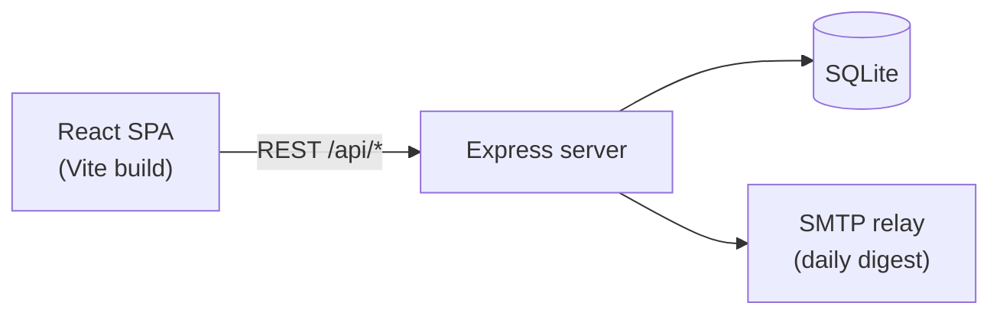
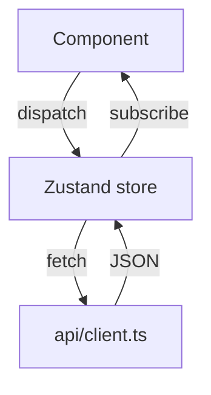

# Architecture

## System map

## Frontend data flow

## Module map

| Area | Path | Notes |
|---|---|---|
| Routes | `src/pages/` | One folder per route |
| Shared UI | `src/components/` | 23 components |
| State | `src/store/` | Zustand, one slice per domain |
| API client | `src/api/client.ts` | All requests go through here |
| Server | `server/` | Express app, REST only |
